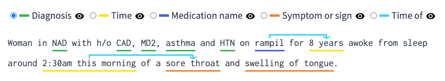

# react-text-annotate

[](https://www.npmjs.com/package/react-text-annotations)

A React component for viewing and editing annotations and relations on text.

## Usage

React is required as a peer dependency of this package.

```
npm install react-text-annotations
yarn add react-text-annotations
```

## Example



## Docs and interactive demos

Coming soon

## Sample code

```tsx
import React, { useState } from "react";
import { Annotator } from "react-text-annotations";

const Sample = () => {
  const sampleText = "Hello world";
  const [annotations, setAnnotations] = useState([
    {
      key: "sample_label",
      name: "Sample label",
      values: [{ start: 0, end: 5 }],
    },
  ]);
  return (
    <Annotator
      text={sampleText}
      annotations={annotations}
      relations={[]}
      onChangeAnnotations={setAnnotations}
    />
  );
};
```

## Approach taken

#### Using SVG

This library leaves the text as is and uses a separate svg layer for drawing annotations and relations. The alternative (used in other libraries) is to break down the text into spans (based on where the annotations are) and then individually style those spans (usually by giving a background color to annotations).

#### Advantages

The svg layer gives us a lot of freedom for drawing. It is possible to render overlapping annotations or even relations while those things would be hard or impossible with a span based approach.

#### Current limitations

Knowing the position of every text character is necessary to draw on the svg layer. For simplicity and performance this library currently only support monospace fonts for the rendered text (fonts whose letters and characters each occupy the same amount of horizontal space). Future versions of this library could support any font by getting the position of every character after rendering.
